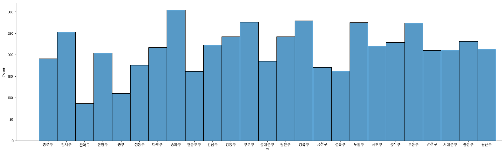

# AED Coverage

## Data 

2021년 7월에 수집하여 이후 데이터와는 결과가 다를 수 있습니다.

## Summary

1. Data Collection

   - AED 주소 데이터 : [E-gen 자동심장충격기(AED) 찾기](https://www.e-gen.or.kr/egen/search_aed.do?searchType=general) - \[서울특별시\] - \[검색\] - \[검색결과 다운로드\]
   - 서울시 소방서 주소 데이터 : [공공데이터포털 - 서울특별시 소방서 현황](https://www.data.go.kr/data/15047342/fileData.do)
   - 서울시 119 안전센터 좌표 데이터 : [서울 열린데이터 광장 - 서울시 안전센터관할 위치정보](http://data.seoul.go.kr/dataList/OA-12740/S/1/datasetView.do)
   - 서울시 구급활동일지 : 서울소방재난본부
   - 서울시 행정동/기초구역/그리드 인구 데이터 : [국토정보맵](http://map.ngii.go.kr/ms/map/NlipMap.do?tabGb=statsMap)
   - 급성심장정지조사('2019) : [국가통계포털](https://kosis.kr/common/meta_onedepth.jsp?vwcd=MT_OTITLE&listid=117_11788)

2. Data Preprocessing

   - AED, 소방서 > 좌표로 변환 : 네이버 맵 Geocoding API 이용 [(ipynb)](02-01.%20Data%20Preprocessing%20-%20주소로부터%20좌표%20데이터%20추출.ipynb)
   - 구급활동일지 : 심정지 환자만 추출 및 결측치가 있는 행 제거 [(ipynb)](02-02.%20Data%20Preprocessing%20-%20구급활동일지.ipynb)

3. EDA
   1. AED in Seoul [(ipynb)](03-01.%20EDA%20-%20AED%20관련%20Insight.ipynb)

      1. 각 행정구별 등록된 AED 수 - 관악구가 가장 적은 수를 지님

      

      ※ 참고사항 : [관악구 우리 동네 지도](http://www.gwanak.go.kr/map/map_main.jsp?mapId=02)에 따르면 관악구의 자동심장충격기 수는 173개로 E-gen의 데이터와 차이가 있다.

      2. 각 행정구별 10만명 당 AED 수 - 관악구가 가장 낮음

         

      3. 각 행정구별 1제곱미터 당 AED 수 - 관악구가 가장 낮음

         

         4. 지도 시각화는 ipynb 파일 참고

         - Insight : 관악구의 AED 취약 지점 분석

   2. 구급활동일지 [(ipynb)](03-02.%20EDA%20-%20구급활동일지.ipynb)

      1. 환자 연령별 발생 건수

         

      2. 구급처종명별 발생 건수

         

      3. 심정지 장소까지 걸린 시간

         

      4. 현장과의 거리와 걸린 시간 사이의 관계

         

4. Visualization
   1. 서울시와 관악구의 취약 지점 시각화

      1. 서울시 취약 지점 (1km x 1km 그리드) [(ipynb)](04-01.%20Visualization%20-%20서울시.ipynb)

         

         

      2. 관악구 취약 지점 (100m x 100m 그리드)

         잠재 OHCA 계산식 : 공간 최적화 모형을 이용한 자동심장충격기(AED) (김감영, 2021)

         

         

   2. MCLP 알고리즘을 이용한 AED 배치 장소 최적화 및 시각화 [(ipynb)](04-02.%20Visualization%20-%20관악구%20%26%20MCLP.ipynb)

      1. 가장 취약한 10곳만 우선 배치

      

      2. 모든 곳이 커버되는 최소 AED 수 구하기 - 30개

      
